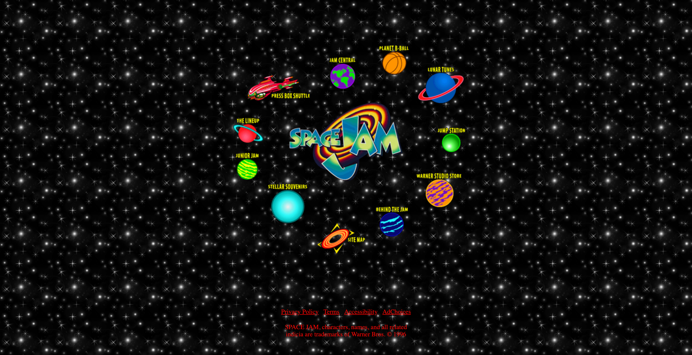

# Space Jam Website

This is a static recreation of the [homepage for the 1996 movie Space Jam](https://www.warnerbros.com/archive/spacejam/movie/jam.htm). 

You can view the live version of this project on [Github Pages](https://wittenbrock.github.io/space-jam-website-clone/).

My goal for this project was to learn how to use CSS grid. I chose the Space Jam website because it was originally built using HTML tables to create its layout structure, making it a perfect candidate to be refactored using CSS Grid.

# Screenshot

